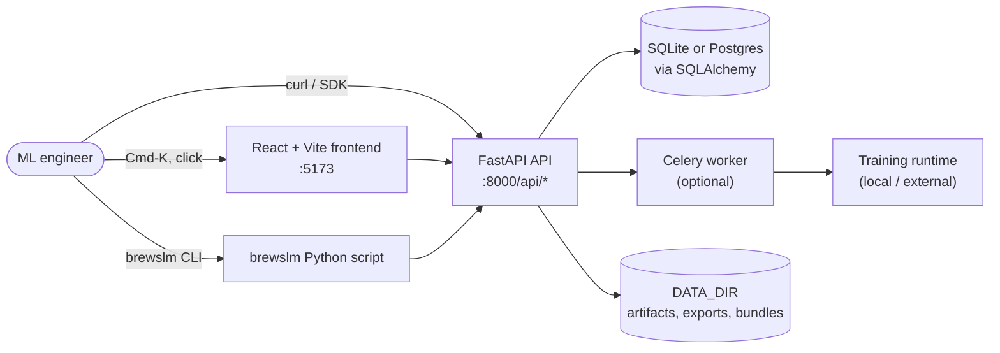
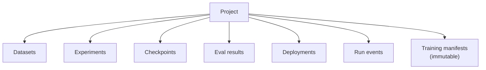
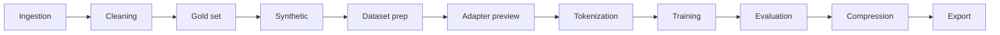

# Architecture

BrewSLM is three processes plus a database:



- **Frontend** is a Vite + React app served on port 5173 in dev. Cmd-K palette, sidebar, every workspace page.
- **API** is a FastAPI app on port 8000. Every `/api/*` route is documented in [API surface](../reference/api-surface.md) and the live Swagger UI at `/api/docs`.
- **CLI** (`backend/scripts/brewslm.py`) is a thin HTTP client over the API. Everything you can do in the UI you can do here — see [CLI reference](../reference/cli.md).
- **DB** is SQLite by default for local work; Postgres in production. SQLAlchemy + Alembic for migrations.
- **Celery worker** is optional — only the "external" training runtime backend dispatches via Celery. Local simulation and direct runs don't need it.

## Project boundary

Every artifact in BrewSLM lives inside a **project**. The project is the unit of authorization, billing, manifest scope, and observability scope. When you see `/api/projects/{id}/...`, that's the project boundary.



A project has:

- One or more **datasets** (raw documents → cleaned → prepared rows).
- Zero or more **experiments** (training runs) that produce **checkpoints** + **eval results**.
- A **manifest** snapshotted at each training launch (immutable; see [Pipeline-as-Code](../workflows/pipeline-overview.md)).
- A stream of **RunEvents** (the unified observability log — see [Run events](../observability/run-events.md)).
- Zero or more **deployments**, each pinned to a checkpoint + target profile.

## The pipeline

Most workflows flow through the canonical 11-stage pipeline:



Each stage has its own page under [Pipeline workflows](../workflows/pipeline-overview.md). Stages can be:

- **Skipped** for some flows (e.g., compression is optional).
- **Re-run** independently from a manifest (see [Pipeline-as-Code](../workflows/pipeline-overview.md)).
- **Automated** via Autopilot v3 (see [Newbie Autopilot](../workflows/newbie-autopilot.md)).

## Observability layer

Every stage emits canonical `RunEvent` rows into one table. The Observability plane reads from there:

```mermaid
flowchart TD
  stages["Each stage service<br/>(ingestion, training, eval, …)"]
  stages -->|emit_event()| run_events[("run_events table")]
  run_events --> timeline["Timeline service<br/>(tree-ordered)"]
  run_events --> clusters["Failure cluster service<br/>(idempotent recompute)"]
  run_events --> bundles["Support bundle service<br/>(redacted zip export)"]
  timeline --> ui1["Run Timeline page"]
  clusters --> ui2["Failure Analysis page"]
  bundles --> ui3["Support Bundle card"]
```

The same table powers the [audit log](../reference/api-surface.md), the support bundle (used for hand-off when something breaks), and the Cmd-K palette's "recent runs" surface.

## Extensions layer

Four plugin kinds extend the platform — see [Extensions](../extensions/contracts.md):

- **Data adapter** plugins map raw rows into BrewSLM's canonical record shape.
- **Training runtime** plugins add new launchers (local, Celery, your own).
- **Domain pack** plugins ship reusable training/eval overlays for a domain.
- **Eval pack** plugins add task-aware metric schemas + gate policies.

All four pass through one contract suite (`plugin_contracts.py`) before they're loaded.

## File layout (developer's eye view)

```
backend/
  app/
    api/            # FastAPI routers, one file per resource
    models/         # SQLAlchemy ORM
    services/       # business logic (one file per concern)
    schemas/        # Pydantic request/response shapes
  alembic/          # DB migrations
  scripts/
    brewslm.py      # the CLI
  tests/            # pytest suite (phaseNN_*.py)

frontend/
  src/
    pages/          # one page per workspace surface
    components/     # reusable pieces
    api/client.ts   # axios wrapper
    stores/         # Zustand stores

slm-docs/           # this Docusaurus site
data/               # DATA_DIR (projects, exports, bundles, scaffolds)
```

## Next

- [Projects + artifacts](projects-and-artifacts.md) — the data model behind every API call.
- [Pipeline stages](pipeline-stages.md) — what each stage produces.
- [Beginner mode](beginner-mode.md) — what gets hidden, why, and how to leave it.
