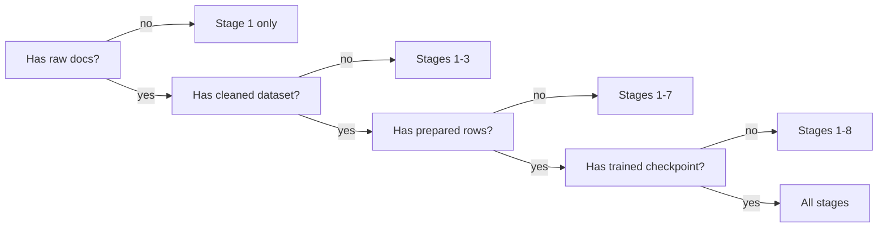

# Pipeline stages

BrewSLM's pipeline has **11 canonical stages**, defined once in `app/models/run_event.py` and consumed by the readiness service, the timeline, the workflow runner, and the sidebar. Each stage corresponds to:

- One service module (`app/services/*_service.py`).
- One API resource (`/api/projects/{id}/<stage>/...`).
- A tab in the workspace sidebar (under **Pipeline** rail).
- A `stage` value on every `RunEvent` it emits.

## The 11 stages

| # | Stage | Service | Produces |
|---|---|---|---|
| 1 | `ingestion` | `ingestion_service` | `RawDocument` rows + raw artifacts in `DATA_DIR/projects/{id}/raw/`. |
| 2 | `cleaning` | `cleaning_service` | A cleaned `Dataset` version with PII/dup/outlier stats. |
| 3 | `gold_set` | `gold_service` / `gold_workbench_service` | `GoldSetVersion` + `GoldSetRow` (the ground-truth eval set). |
| 4 | `synthetic` | `synthetic_service` | Generated Q&A pairs joined to a dataset. |
| 5 | `dataset_prep` | `dataset_service` | Normalised, deduped, split prepared records. |
| 6 | `data_adapter_preview` | `data_adapter_service` | An adapter contract (which fields map where). |
| 7 | `tokenization` | `tokenization_service` | Tokenized dataset under `prepared_dir`. |
| 8 | `training` | `training_service` + a runtime plugin | Checkpoints + an immutable manifest. |
| 9 | `evaluation` | `evaluation_service` | `EvalResult` rows per gate / metric set. |
| 10 | `compression` | `compression_service` | Quantized / pruned model weights. |
| 11 | `export` | `export_service` | A deployable artifact for a target profile. |

Plus three cross-cutting "virtual" stages used by RunEvents only:

- `deployment` — every action on `/api/deployments/...`.
- `autopilot` — every plan / repair / snapshot action.
- `system` — startup, plugin reloads, config validation, support bundles.

## Stage ordering + unlocks

Stages unlock progressively in beginner mode. The readiness service (`readiness_service.py`) decides what's runnable based on what artifacts exist:



In the sidebar (Pipeline rail), stages you can't run yet are dim-greyed and disabled. Stages that completed show a green dot; in-progress shows a black dot.

## Emit pattern

Every stage service wraps its work in a best-effort RunEvent emit. The pattern (intentionally minimal so observability bugs never break the stage):

```python
async def some_stage_action(...):
    try:
        await emit_event(
            db,
            project_id=project_id,
            run_id=run_id,
            stage=STAGE_TRAINING,
            severity=SEVERITY_INFO,
            summary=f"Started training experiment {experiment_id}",
        )
    except Exception:
        pass  # observability never breaks the action it reports on

    # ... actual work ...

    try:
        await emit_event(
            db,
            project_id=project_id,
            run_id=run_id,
            stage=STAGE_TRAINING,
            severity=SEVERITY_ERROR,
            reason_code=TRAINING_RUNTIME_ERROR,
            summary=f"Training failed: {exc}",
        )
    except Exception:
        pass
```

Notice the **`reason_code` is required** on `error` / `critical` severities. The taxonomy lives in `app/models/reason_codes.py`. See [Failure clusters](../observability/failure-clusters.md) for the full list.

## Stage → page in the UI

| Stage | Sidebar entry |
|---|---|
| Stages 1–7 | **Pipeline** rail → that stage's tab. |
| Stage 8 Training | **Training** rail → Configurations / Models / Adapter Studio / Autopilot Planner. |
| Stage 9 Evaluation | **Pipeline** rail → Eval tab, or **Training** rail → Playground. |
| Stage 10 Compression | **Pipeline** rail → Compression tab. |
| Stage 11 Export | **Pipeline** rail → Export tab, or **Training** rail → Deployments. |
| `deployment` | **Training** rail → Deployments + Observability. |
| `autopilot` | **Training** rail → Autopilot Planner. |
| `system` | **Training** rail → Observability (timeline filter `stage=system`). |

## Next

- [Beginner mode](beginner-mode.md) — what gets hidden.
- [Pipeline overview](../workflows/pipeline-overview.md) — per-stage walkthroughs.
- [Run events](../observability/run-events.md) — the canonical log every stage writes to.
