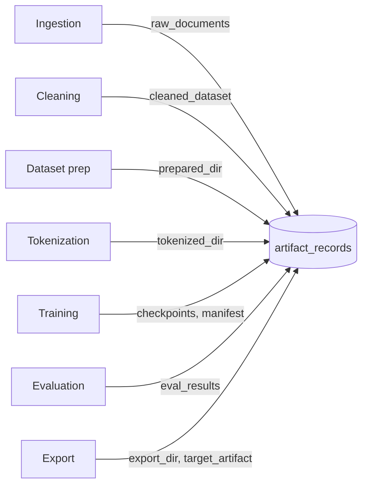

# Projects + artifacts

## Project = scope boundary

Every API request goes through a project. The project is what authorization checks against (when auth is enabled), what manifests describe, what `DATA_DIR/projects/{id}/` collects on disk, and what the sidebar's "Project" badge shows.

| Property | What it controls |
|---|---|
| `id` | Numeric primary key, used in every `/api/projects/{id}/...` route. |
| `name` | Human-readable label, shown in the sidebar and the project list. |
| `status` | `active` / `archived`. Archived projects are hidden from new work. |
| `beginner_mode` | Hides advanced surfaces in the UI. See [Beginner mode](beginner-mode.md). |
| `domain_pack_id`, `domain_profile_id` | Active domain overlay (see [Domain Packs](../workflows/pipeline-overview.md)). |
| `active_domain_blueprint_version` | Pinned blueprint version for reproducibility. |
| `created_at`, `updated_at` | Standard timestamps. |

## Create a project

### UI

Navigate to the project list (root `/`) → click **New Project**. The wizard asks for a name, an optional starter template (general / support / legal), and whether to start in beginner mode. Submit and you land on the workspace.

### CLI

```sh
brewslm project create --name "Phase A test" --template general
```

Templates live under `slm-docs/static/` and on disk; see `brewslm project create --help` for the full list.

### API

```sh
curl -X POST http://localhost:8000/api/projects \
  -H "Content-Type: application/json" \
  -d '{"name": "Phase A test", "template": "general"}'
```

Returns the created project; `201 Created` on success.

## Artifacts

An **artifact** is any persisted output that another stage might depend on. The artifact registry (`artifact_records` table) keeps a record of every notable file produced in a run so downstream code can find it without guessing paths.



Every record has:

- `project_id` + `artifact_key` (unique per project, like `experiment.42.final_checkpoint`).
- `schema_ref` — a string like `slm.checkpoint/v1` that identifies the artifact contract.
- `producer_stage` — which pipeline stage made it.
- `metadata` — free-form JSON, kept compact.
- `created_at`.

## Inspecting artifacts

### UI

The workspace doesn't surface every artifact directly — they're plumbing. Where they matter, they show up:

- **Models page** lists checkpoints (`checkpoints` table).
- **Eval Compare** drawer shows eval_results.
- **Deployments page** lists deployment versions (which point at checkpoints).
- **Observability → Support bundle** packages selected sections of the registry into one zip for hand-off.

### CLI

```sh
brewslm doctor --project 7 --deep
```

`--deep` adds the timeline + failure cluster summary, so blockers like "missing tokenizer" jump out.

### API

```sh
curl "http://localhost:8000/api/projects/7/runtime/readiness"
```

Returns the readiness checks (CPU, GPU, optional packages, artifact prerequisites for the next stage).

## Lineage

Every checkpoint links back to its **immutable training manifest** (see [Pipeline-as-Code](../workflows/pipeline-overview.md)). The manifest captures:

- Base model + tokenizer references.
- Dataset version IDs (prepared + tokenized).
- Adapter + domain pack overlay.
- Trainer config (LR, batch, optimizer, …).
- Target profile (mobile / edge / server / browser).

That means **any past run can be replayed** by re-applying the manifest. The Rerun + Clone CLI commands lean on this:

```sh
brewslm train rerun --experiment 42
brewslm train clone --experiment 42 --name "phase-a-rerun"
```

See [Training](../workflows/training.md) for the full workflow.

## Next

- [Pipeline stages](pipeline-stages.md) — what each stage produces.
- [Beginner mode](beginner-mode.md) — what gets hidden in the UI.
- [Run events](../observability/run-events.md) — the unified observability log.
