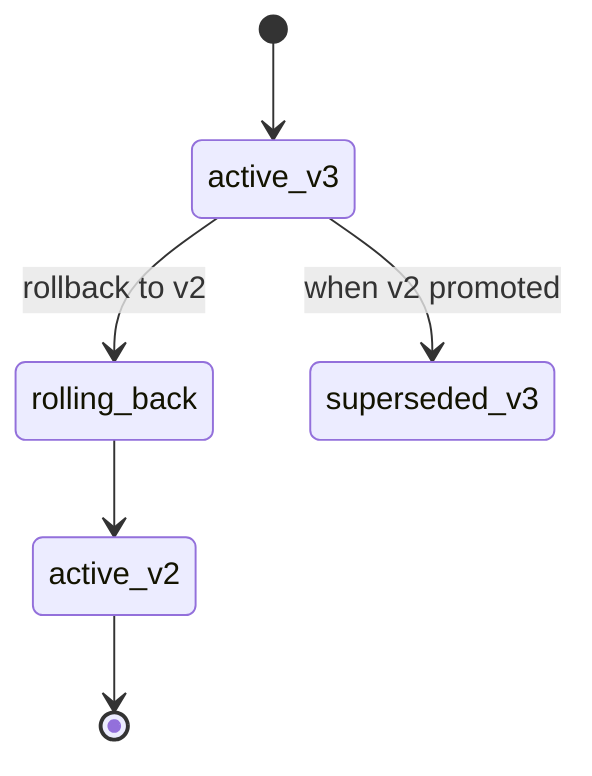

# Rollback + Deployability score

Once drift or telemetry tells you something's wrong, you have two responses: **roll back** to the previous deployment, or **stop the bleeding** (block new requests). The Deployability score wraps the same signals into a single 0–1 rating so you can decide quickly.

## Rollback

### Lifecycle



Rollback flips the `active` pointer **back** to the most recent `superseded` deployment, or to one you explicitly specify. The previous active becomes `superseded` again (not deleted; you can roll forward later if it turns out the rollback was unnecessary).

### UI

Deployments detail → **Rollback** (top right of an `active` deployment). The dialog asks:

- **Target** — which superseded version to roll back to (defaults to the most recent).
- **Reason** — required; lives in the audit log.

Click **Rollback**. The list refreshes; the chosen version is now `active`.

### CLI

```sh
brewslm deploy rollback \
  --deployment 17 \
  --target-version v2 \
  --reason "drift > tolerance after v3 promote"
```

### API

```sh
curl -X POST http://localhost:8000/api/deployments/17/rollback \
  -H "Content-Type: application/json" \
  -d '{
    "target_version": "v2",
    "reason": "drift > tolerance after v3 promote"
  }'
```

Returns the new active deployment record plus a `deployment_rollbacks` audit row.

### When rollback isn't enough

If your previous version is itself broken (e.g., the regression came from upstream data, not a code change), rollback won't help. Instead:

1. **Block traffic** at your serving layer.
2. Generate a **[support bundle](../observability/support-bundles.md)** to forward to whoever owns the upstream component.
3. Pick a known-good checkpoint from the [Models page](../workflows/training.md) and promote a fresh deployment from there.

## Deployability score

The score is a single 0–1 rating that **blends measured signals with estimated compatibility checks**. Every component is labelled with provenance so you can tell which signal moved the needle.

Score sources:

| Component | Provenance | Weight |
|---|---|---|
| Smoke pass rate at promote | `measured` | 0.30 |
| Live telemetry health (last window) | `measured` | 0.25 |
| Drift delta vs baseline | `measured` (if recent check), else `estimated` (0) | 0.20 |
| Target compatibility (artifact present, runtime installed, weight size within budget) | `estimated` | 0.15 |
| Historical reliability (rolling N deployments for this target) | `measured` | 0.10 |

If any **required** component is missing (no smoke run, no recent telemetry), the score caps at `0.6` with `provenance: "estimated"` on the missing slice. The point: you can't accidentally read a green score from a deployment that hasn't been measured.

### Read the score

UI: Deployments detail → **Deployability** card at the top. Shows:

- Score 0–1 + verdict (`ready` / `caution` / `block`).
- Per-component table with weight, value, provenance.
- A timeline of historical scores for this target profile.

CLI:

```sh
brewslm deploy score --deployment 17
```

API:

```sh
curl http://localhost:8000/api/deployments/17/deployability
```

Returns:

```json
{
  "deployment_id": 17,
  "score": 0.78,
  "verdict": "caution",
  "components": [
    {"name": "smoke_pass_rate",        "value": 1.0,  "weight": 0.30, "provenance": "measured"},
    {"name": "telemetry_health",       "value": 0.92, "weight": 0.25, "provenance": "measured"},
    {"name": "drift_delta",            "value": 0.55, "weight": 0.20, "provenance": "measured"},
    {"name": "target_compatibility",   "value": 1.0,  "weight": 0.15, "provenance": "estimated"},
    {"name": "historical_reliability", "value": 0.85, "weight": 0.10, "provenance": "measured"}
  ],
  "computed_at": "2026-05-12T11:30:00Z"
}
```

### Verdicts

| Verdict | Score range | Action |
|---|---|---|
| `ready` | ≥ 0.85 | Promote / keep serving. |
| `caution` | 0.60–0.85 | Investigate the dropped components. Often a fresh drift check or extra smoke prompts is enough. |
| `block` | < 0.60 | Don't promote. If active, consider rollback or block traffic. |

The CLI exits with code `2` on `block`, `1` on `caution`, `0` on `ready` — useful as a CD gate.

## Next

- [Run Timeline](../observability/timeline.md) — see drift / score events in context.
- [Support bundles](../observability/support-bundles.md) — package the evidence for hand-off.
