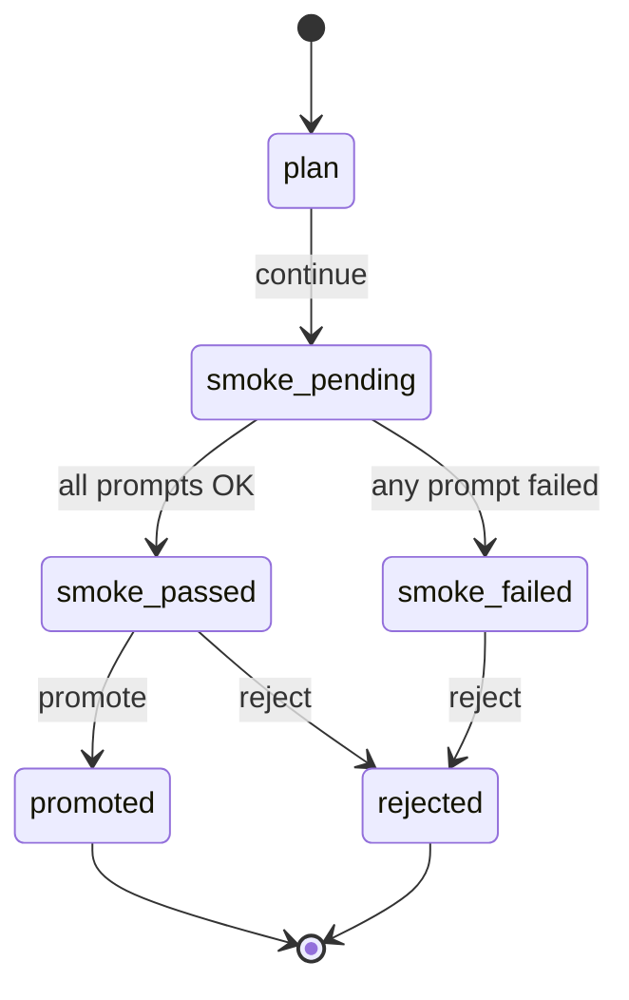

# Smoke test, then promote

After a [plan](plan.md) reports green readiness, you **smoke test** with a handful of prompts before promoting the deployment to "active". Promote is the act that flips traffic to the new version. Reject is the safe alternative when smoke shows trouble.

## The promote lifecycle



Once `promoted`, the deployment is **live** — telemetry starts flowing, drift checks become available, the [Deployability score](rollback-and-score.md) updates. Once `rejected`, the deployment is archived as a dead branch but its plan + smoke trace stays for the audit log.

## Smoke test

Smoke runs your selected prompts (defaults to 5 random rows from your active eval pack's gold set) through the candidate checkpoint via the target runtime. For each prompt:

- Compares the output to the gold answer using the eval pack's metric (exact-match, LLM-judge, etc.).
- Records latency p50/p95 and token throughput.
- Flags failures with the same `reason_code` taxonomy as the eval stage.

### UI

On the Deployments page → New deployment → after plan, **Run smoke test** appears. Click; the table fills in row-by-row as each prompt completes. A green check on a row means "passed gate"; red is "failed".

### CLI

```sh
brewslm deploy smoke-test \
  --deployment plan_8c9d… \
  --prompts 5
```

Streams results as they come back. Exit non-zero if any prompt fails its gate — wire this into your CI for promote-as-code.

### API

```sh
curl -X POST http://localhost:8000/api/deployments/plan_8c9d…/smoke \
  -H "Content-Type: application/json" \
  -d '{"prompt_count": 5}'
```

Returns:

```json
{
  "deployment_id": 17,
  "smoke_status": "smoke_passed",
  "rows": [
    {"prompt_id": "g_001", "passed": true,  "metric": "exact_match", "score": 1.0, "latency_ms": 88},
    {"prompt_id": "g_002", "passed": true,  "metric": "exact_match", "score": 1.0, "latency_ms": 92},
    {"prompt_id": "g_003", "passed": false, "metric": "exact_match", "score": 0.0, "latency_ms": 91, "reason_code": "eval_runtime_error"},
    ...
  ],
  "summary": {"passed": 4, "failed": 1, "p50_ms": 91, "p95_ms": 142}
}
```

## Promote

### UI

Smoke-passed deployment → **Promote** button (top right of the Deployments detail). A confirm dialog summarizes:

- What's being demoted (the previous `active` deployment, if any).
- What's being promoted (this one).
- A reason field (required; lives in the audit log).

### CLI

```sh
brewslm deploy promote --deployment 17 --reason "phase A green smoke"
```

### API

```sh
curl -X POST http://localhost:8000/api/deployments/17/promote \
  -H "Content-Type: application/json" \
  -d '{"reason": "phase A green smoke"}'
```

Side effects:

1. Sets this deployment's `status = "active"`.
2. Demotes the previous active to `"superseded"` (still queryable, can be rolled back to).
3. Writes a `deployment_versions` row capturing checkpoint id, target, smoke summary, actor.
4. Emits a RunEvent (`stage=deployment, severity=info`) — surfaces in the [timeline](../observability/timeline.md).

## Reject

For deployments that smoke poorly OR that you decided not to ship:

### UI

Deployments detail → **Reject**. Reason required. The deployment is archived; no traffic ever sees it.

### CLI

```sh
brewslm deploy reject --deployment 17 --reason "drift > tolerance vs prev gold"
```

### API

```sh
curl -X POST http://localhost:8000/api/deployments/17/reject \
  -H "Content-Type: application/json" \
  -d '{"reason": "drift > tolerance vs prev gold"}'
```

## What promote does *not* do

- **It doesn't push files anywhere.** Promote flips an internal pointer + audit row; you still have to ship the export bundle to your serving env yourself (HF Hub, S3, the target server). The [export stage](../workflows/export-and-deployment.md) handles the actual artifact build.
- **It doesn't restart your server.** vLLM, Ollama, etc. have their own model-reload semantics. The deployment record tracks *which* checkpoint is supposed to be serving; the actual reload is your runbook.

## Next

- [Telemetry](telemetry.md) — what to measure after promote.
- [Drift checks](drift-checks.md) — re-run gold eval against the live endpoint.
- [Rollback + score](rollback-and-score.md) — when smoke was good but production isn't.
