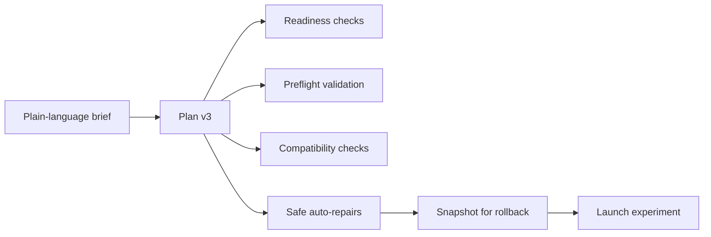

# Newbie Autopilot

Autopilot v3 takes a plain-language brief and proposes a full pipeline plan: adapter, base model, training recipe, eval pack, target profile. Every decision is **labelled with provenance** (`measured` vs `estimated`) and written to a persisted decision log so you can audit what it did and why.

It's the fastest way to get from "I have an idea" to "the model is training", and the safest way to iterate without forgetting what changed between runs.

## What it does



Behind the scenes:

1. Readiness — does this project have enough artifacts to even run? Reports blockers.
2. Preflight — does the proposed config compile against the base model's contract?
3. Compatibility — tokenizer / chat template / runtime / target profile compatibility.
4. Auto-repairs — adapter fallback, model fallback within license + target constraints, conservative LR scaling.
5. Snapshot — captures pre-run state for rollback.
6. Launch — starts the training experiment with the resolved plan.

## Plan, then run

Two-phase by design. **Plan** is read-only and cheap; **Run** acts on the snapshot. You can plan dozens of times before running once.

### UI

Training rail → **Autopilot Planner**.

1. Top input: paste a brief in plain English. *"Support FAQ tone, concise, never hallucinate beyond dataset, deploy on vLLM."*
2. Click **Plan**. The planner returns:
   - Proposed dataset adapter + reason.
   - Proposed base model + provenance.
   - Proposed training recipe + estimated cost / GPU-hours / CO2.
   - Proposed eval pack + gates.
   - Proposed target profile.
   - **Blockers** (if any) with concrete remediation links.
   - **Strict-mode preview** — what would be refused under stricter rules.
3. Toggle **Strict mode** if you want autopilot to refuse all fallbacks instead of taking safe ones.
4. Inspect the **Decision log drawer** (button top-right) — every node of the plan with the `provenance` per component.
5. Click **One-click run** when you're happy, or **Repair preview** to see what changed before run.

### CLI

```sh
# Plan only
brewslm autopilot plan --project 1 \
  --intent "Support FAQ tone, concise, never hallucinate beyond dataset, deploy on vLLM."

# Plan + one-click run
brewslm autopilot run --project 1 \
  --intent "Support FAQ tone, concise, never hallucinate beyond dataset, deploy on vLLM." \
  --one-click

# Strict mode (refuse fallbacks)
brewslm autopilot run --project 1 \
  --intent "..." \
  --strict
```

### API

```sh
# Plan
curl -X POST http://localhost:8000/api/projects/1/autopilot/plan \
  -H "Content-Type: application/json" \
  -d '{"intent": "Support FAQ tone, concise…"}'

# Run a known plan id
curl -X POST http://localhost:8000/api/projects/1/autopilot/run \
  -H "Content-Type: application/json" \
  -d '{"plan_id": "auto_a3f9c…"}'

# Repair preview (no-op until you accept)
curl -X POST http://localhost:8000/api/projects/1/autopilot/repair-preview \
  -H "Content-Type: application/json" \
  -d '{"plan_id": "auto_a3f9c…"}'
```

## Typical auto-repairs

| Blocker | Repair |
|---|---|
| Base model fails tokenizer check | Fall back to a tested model in the same family (`Qwen2.5-1.5B-Instruct` → `Qwen2.5-0.5B-Instruct`). |
| Target profile incompatible (e.g. 7B on mobile_cpu) | Fall back to next-larger target OR suggest compression. |
| Adapter `auto` couldn't match | Pick a default-canonical adapter if the columns look canonical. |
| LR too aggressive for tiny dataset | Scale LR by `sqrt(rows/1000)` and add warmup. |
| Eval pack missing | Generate a starter from the project blueprint. |

Strict mode refuses every repair and surfaces the blockers verbatim. Reach for strict mode when **reproducibility matters more than convenience** — e.g., a CI gate.

## Decision log

Every run produces an `AutopilotDecision` row. The drawer (Autopilot Planner page → top-right icon) shows:

- Brief.
- Resolved plan (every field + provenance).
- Repairs applied (or refused).
- Snapshot id (for rollback).
- Outcome (`launched`, `blocked`, `rolled_back`).

The decision log is the **canonical answer** to "why did this run use these settings?" It's also what `brewslm autopilot show --decision <id>` prints.

## Rollback

If autopilot took a fallback you didn't intend (or a downstream stage misbehaved), you can roll back to the snapshot captured before run:

### UI

Autopilot Planner → Decision log drawer → **Rollback to snapshot** on the matching row.

### CLI

```sh
brewslm autopilot rollback --project 1 --snapshot snap_8c9d…
```

### API

```sh
curl -X POST http://localhost:8000/api/projects/1/autopilot/rollback \
  -H "Content-Type: application/json" \
  -d '{"snapshot_id": "snap_8c9d…"}'
```

The snapshot captures: project blueprint, dataset state, eval pack, training config — everything autopilot might have nudged.

## When *not* to use autopilot

- **You already have a known-good training manifest.** Just `brewslm train rerun --experiment <id>` instead.
- **You're iterating on a single knob.** Edit the recipe directly; autopilot adds noise.
- **You're past the first iteration and want to test a specific hypothesis** ("what if we scale to 4B?"). Use the Training Configurations page.

Autopilot pays off on first / second iterations and when something blocks you. After that, the manifest replay loop is faster.

## Next

- [Training](training.md) — what autopilot launches.
- [Evaluation + remediation](evaluation-and-remediation.md) — what runs after.
- [Measured vs estimated](../reliability/measured-vs-estimated.md) — reading the provenance labels.
