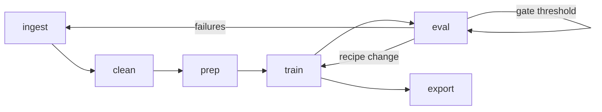

# Pipeline overview

BrewSLM's pipeline is **11 canonical stages**, defined once in `app/models/run_event.py` and used everywhere — the sidebar tabs, the readiness service, the timeline view, every `RunEvent`'s `stage` field.

For the conceptual primer see [Concepts → Pipeline stages](../concepts/pipeline-stages.md). This page is the practical map: where each stage lives, what it produces, and what the next page should be.

## The 11 stages

| # | Stage | Page | Produces |
|---|---|---|---|
| 1 | Ingestion | [Data ingestion](data-ingestion.md) | `RawDocument` rows under `DATA_DIR/projects/{id}/raw/`. |
| 2 | Cleaning | [Data ingestion](data-ingestion.md#step-2--clean) | Cleaned dataset version, PII stats. |
| 3 | Gold set | [Evaluation + remediation](evaluation-and-remediation.md#step-1--build-the-gold-set) | `GoldSetVersion` (the eval ground truth). |
| 4 | Synthetic | [Data ingestion](data-ingestion.md#optional--synthetic-augmentation) | Generated Q&A pairs joined to a dataset. |
| 5 | Dataset prep | [Data ingestion](data-ingestion.md#step-3--dataset-prep) | Normalised, deduped, split records. |
| 6 | Adapter preview | [Adapter examples](../getting-started/adapter-studio-examples.md) | Adapter contract for the data shape. |
| 7 | Tokenization | [Data ingestion](data-ingestion.md#tokenization) | Tokenized dataset under `prepared_dir/`. |
| 8 | Training | [Training](training.md) | Checkpoints + an immutable manifest. |
| 9 | Evaluation | [Evaluation + remediation](evaluation-and-remediation.md) | `EvalResult` rows. |
| 10 | Compression | [Export + deployment](export-and-deployment.md#compression) | Quantized weights. |
| 11 | Export | [Export + deployment](export-and-deployment.md) | Target-shaped deployable artifact. |

## Iteration loop, not waterfall

Don't read the table top-to-bottom and assume you only ever go forward. Real projects iterate:



A typical project does 3–5 iteration loops before its first deployment. The platform's job is to make those loops cheap (training manifest replay, eval pack reuse, autopilot suggestions) — not to discourage them.

## When stages unlock

Beginner mode gates stage tabs by **what artifacts already exist**. The Pipeline rail in the sidebar dims and disables any stage that can't yet run.

| To unlock | You need |
|---|---|
| Cleaning | At least one ingested document. |
| Gold set / Synthetic | A cleaned dataset. |
| Dataset prep / Tokenization | A cleaned dataset (gold/synthetic are optional). |
| Training | A tokenized dataset + a selected base model. |
| Evaluation | A completed training run + a gold set + an eval pack. |
| Compression / Export | A trained checkpoint. |

The unlock logic is the same one the [readiness service](../reliability/common-blockers.md) reports on for `brewslm doctor`.

## Where each stage lives in the UI

```
Sidebar
├── Pipeline rail       (stages 1–7, 9–11)
│   ├── Data            → ingestion
│   ├── Cleaning        → cleaning
│   ├── Gold set        → gold_set
│   ├── Synthetic       → synthetic
│   ├── Data prep       → dataset_prep
│   ├── Tokenization    → tokenization
│   ├── Eval            → evaluation
│   ├── Compression     → compression
│   └── Export          → export
└── Training rail       (stage 8 + adjacent)
    ├── Configurations  → training config
    ├── Models          → base model registry
    ├── Adapter Studio  → adapter overrides (hidden in beginner mode)
    ├── Autopilot       → planner v3
    ├── Playground      → quick interactive try-out
    ├── Deployments     → see Deployment section
    └── Observability   → timeline + clusters + bundles
```

## When to use which surface

Stage execution can happen on any of three surfaces. They write to the same underlying tables.

| You want to | UI | CLI | API |
|---|---|---|---|
| Explore a new dataset interactively | ✅ Pipeline tabs | — | — |
| Re-run a known-good config in CI | — | ✅ `brewslm train rerun` | ✅ `POST /api/projects/{id}/experiments/rerun` |
| Integrate with your data warehouse | — | — | ✅ `POST /api/projects/{id}/datasets/upload` |
| Demo to a stakeholder | ✅ The UI shows progress | — | — |
| Wire into Airflow / Argo | — | ✅ Every stage has a CLI verb | ✅ Equivalent endpoints |

## What each stage emits

Every stage emits at least one [RunEvent](../observability/run-events.md) per state transition (start, optional progress, end / failure). So the [timeline](../observability/timeline.md) is the right place to look back at "what happened in this project last Tuesday."

## Next

- [Data ingestion](data-ingestion.md) — stage 1 and 2.
- [Newbie autopilot](newbie-autopilot.md) — let the planner pick a path through stages 5–9.
- [Training](training.md) — stage 8 in detail.
- [Evaluation + remediation](evaluation-and-remediation.md) — stages 3 + 9.
- [Export + deployment](export-and-deployment.md) — stages 10 + 11 into a real serving env.
